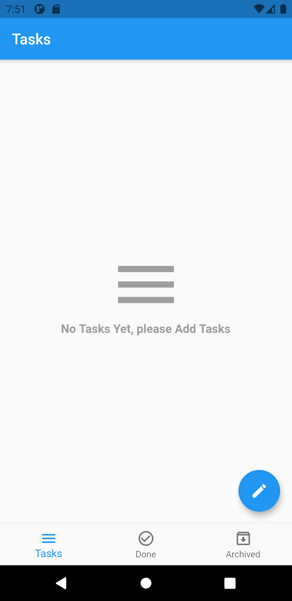

# To-Do App
## _Flutter App to add tasks and mange it_

To-Do App is Aflutter App That help to mange tasks 

- Flutter
- SQflit
- ✨BLOC✨

## Screenshots

## Features

- Add tasks
- Done Tasks
- Archived Tasks
- Delete Tasks

## Plugins

Dillinger is currently extended with the following plugins.
Instructions on how to use them in your own application are linked below.

| Plugin | README |
| ------ | ------ |
| Bloc | [https://pub.dev/packages/flutter_bloc][PlDb] |
| SQflite | [https://pub.dev/packages/sqflite][PlGh] |
| intl | [https://pub.dev/packages/intl][PlGd] |
| conditional builder | [https://pub.dev/packages/conditional_builder][PlOd] |

   [PlDb]: <https://pub.dev/packages/bloc>
   [PlGh]: <https://pub.dev/packages/sqflite>
   [PlGd]: <https://pub.dev/packages/intl>
   [PlOd]: <https://pub.dev/packages/conditional_builder>
   
